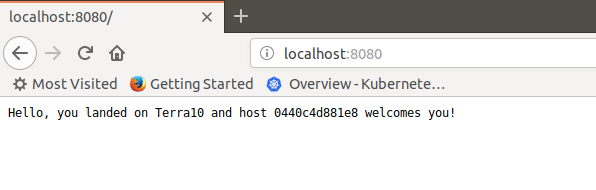
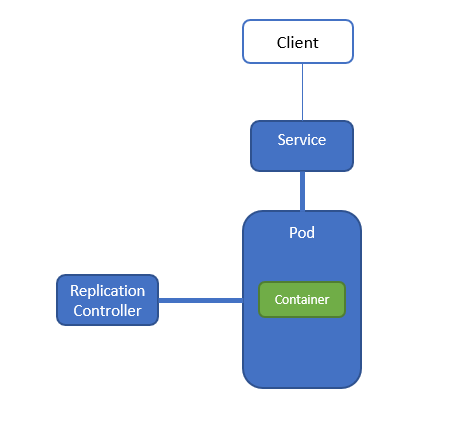
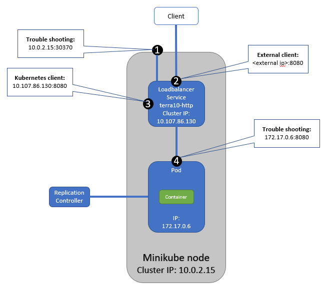

# 1. Pod, Replication Controller, Service - using kubectl

Steps:
1. Run a Docker Container
2. Run the Container in Kubernetes


## 1.1 Run a Docker Container

Run the Container `lgorissen/terra10` in Docker:

```bash
developer@developer-VirtualBox:~$ docker run -d -p 8080:8080 lgorissen/terra10
Unable to find image 'lgorissen/terra10:latest' locally
latest: Pulling from lgorissen/terra10
f189db1b88b3: Pull complete 
3d06cf2f1b5e: Pull complete 
687ebdda822c: Pull complete 
99119ca3f34e: Pull complete 
e771d6006054: Pull complete 
b0cc28d0be2c: Pull complete 
7225c154ac40: Pull complete 
7659da3c5093: Pull complete 
6344e0cb73bc: Pull complete 
Digest: sha256:5b3f0afec5aac18c25749370f4ced0133b43041390cf0891a308d2261df97e7b
Status: Downloaded newer image for lgorissen/terra10:latest
Terra10 HelloWorld Server is starting...
Terra10 HelloWorld Server started
```
Verify that the Container is running:

```bash
developer@developer-VirtualBox:~$ docker ps | grep terra
635340f653cd        lgorissen/terra10            "node terra10.js"        39 seconds ago      Up 37 seconds       0.0.0.0:8080->8080/tcp                                               jovial_kare
developer@developer-VirtualBox:~$ 
```

Pointing the browser to `http://localhost:8080/` invokes the Container and shows the page:



Note that the Container id (0440c4d881e8) is the 'os.hostname' that is displayed in the browser...


## 1.2 Run the Container in Kubernetes


Goal is now to run the Container in Kubernetes. The figure below illustrates the configuration that we want to build:



The figure shows 3 Kubernetes components:
- **Pod**: a group of one or more Containers that is running on the same node
- **Service**: defines a policy on how to access (a number of) Pod(s)
- **ReplicationController**: ensures that a specified number of Pod replicas are running at any one time

We wil establish this configuration in 2 steps:
1. run the Container in a Pod, controlled by a ReplicationController
2. create an endpoint for accessing the terra10 app

### 1.2.1 Run the Container in a Pod
Now, let's run the Container under Kubernetes:
```bash
developer@developer-VirtualBox:~$ kubectl run terra10 --image=lgorissen/terra10 --port=8080 --generator=run/v1
replicationcontroller/terra10 created
developer@developer-VirtualBox:~$ 
```
Where:

| Command (part)  | Description      |
|-------- |--------|
| **kubectl**   |  short for kubectl (is your auto-complete running properly?) |
| **terra10** | name of the ReplicationController that will be created |
| **--image=lgorissen/terra10** | name of the Container image that will be used |
| **--port=8080** | the port that the app will listen to |
| **--generator=run/v1** | indicates that a ReplicationController will be created |


This command has created the ReplicationController `terra10`, which in turn will create the Pod with the `lgorissen/terra10` Container running inside.

Verify that the ReplicationController is there:
```bash
developer@developer-VirtualBox:~$ kubectl get rc
NAME      DESIRED   CURRENT   READY     AGE
terra10   1         1         1         34m
developer@developer-VirtualBox:~$
```
Verify that the Pod is there:

```bash
developer@developer-VirtualBox:~$ kubectl get pod
NAME            READY     STATUS    RESTARTS   AGE
terra10-gtdcl   1/1       Running   0          37m
developer@developer-VirtualBox:~$ 
```
### 1.2.2. create an endpoint for accessing the terra10 app

With the Pod running, now it has to be made accessible. Let's create a Service object to expose the terra10 ReplicationController:
```bash
developer@developer-VirtualBox:~/projects/k4d$ kubectl expose rc terra10 --type=LoadBalancer --name terra10-http
service/terra10-http exposed
developer@developer-VirtualBox:~/projects/k4d$ 
```
The above command creates a Service object of type LoadBalancer. Verify with:
```bash
developer@developer-VirtualBox:~/projects/k4d$ kubectl get services
NAME           TYPE           CLUSTER-IP      EXTERNAL-IP   PORT(S)          AGE
kubernetes     ClusterIP      10.96.0.1       <none>        443/TCP          50d
terra10-http   LoadBalancer   10.107.86.130   <pending>     8080:30370/TCP   16m
developer@developer-VirtualBox:~/projects/k4d$ 
```

You can now access the service using curl:
```bash
developer@developer-VirtualBox:~$ curl 10.107.86.130:8080
Hello, you landed on Terra10 and host terra10-p6vmd welcomes you!
developer@developer-VirtualBox:~$
```


## 1.3 Kubernetes networking
 In the previous section, a Kubernetes Pod was created that runs a Docker Container. We were able to access it, albeit not via the 'external ip address' that would be available in a real-life situation. The Kubernetes networking for this set-up needs some additional clarification.

 The figure below shows a number of access points for our set-up:



The options are:
1. Cluster node ip address
2. Loadbalancer service external ip address
3. Loadbalancer service cluster ip address
4. Pod ip address

To be clear up front: the only access routes for production situations are:

2. Loadbalancer service external ip address - for external clients
3. Loadbalancer service cluster ip address - for clients on the Kubernetes cluster

The other options are good to know for (networking) troubleshooting purposes. Note that these options depend on the level of access you have to the (individual nodes in) your Kubernetes cluster.

### 1.3.1 Cluster node ip address 
The Cluster node in a minikube set-up is named 'minikube':

```bash
developer@developer-VirtualBox:~$ kubectl get nodes
NAME       STATUS   ROLES    AGE   VERSION
minikube   Ready    master   16h   v1.13.2
developer@developer-VirtualBox:~$
```
The ip address is:
```bash
developer@developer-VirtualBox:~$ minikube ip
10.0.2.15
developer@developer-VirtualBox:~$ 
```
The port where our service can be accessed:
```bash
developer@developer-VirtualBox:~$ kubectl get service terra10-http 
NAME           TYPE           CLUSTER-IP      EXTERNAL-IP   PORT(S)          AGE
terra10-http   LoadBalancer   10.107.86.130   <pending>     8080:30370/TCP   3h38m
developer@developer-VirtualBox:~$ 
```
It is the port with the high port number, here: 30370.

The curl command for accessing the service:
```bash
developer@developer-VirtualBox:~$ curl 10.0.2.15:30370
Hello, you landed on Terra10 and host terra10-p6vmd welcomes you!
developer@developer-VirtualBox:~$
```


### 1.3.2. Loadbalancer service external ip address

Well, this can not be demo-ed in a minikube environment as there is no support for Loadbalancer services. If the EXTERNAL-IP would be available, the service should be available via `curl <EXTERNAL-IP>:8080`.

This is how - in a production set-up - external clients will access our service. 

### 1.3.3. Loadbalancer service cluster ip address

The Loadbalancer service has a cluster ip address - which should be used be clients that reside on the Kubernetes platform itself. The cluster ip address in our case is `10.107.86.130` : see above.

The service should be available on this address port `8080`:

```bash
developer@developer-VirtualBox:~$ curl 10.107.86.130:8080
Hello, you landed on Terra10 and host terra10-p6vmd welcomes you!
developer@developer-VirtualBox:~$
```

### 1.3.4. Pod ip address

The Pod can also be accessed directly. First, determine the IP address:
```bash
developer@developer-VirtualBox:~$ kubectl describe pod terra10-p6vmd | grep  IP
IP:                 172.17.0.6
developer@developer-VirtualBox:~$
```
Then, access it:
```bash
developer@developer-VirtualBox:~$ curl 172.17.0.6:8080
Hello, you landed on Terra10 and host terra10-p6vmd welcomes you!
developer@developer-VirtualBox:~$
```

## 1.4 Kubernetes Networking and Pods

A Pod is a group of Containers that runs on the same Kubernetes Node and in the same Linux namespace. Therefore, the Pod not only has its own files and processes, but also its own network interfaces and hostname. So, the Pod has its own IP address and the hostname is the same as the Pod name. IP address and hostname are always unique across the whole Kubernetes cluster.

As a consequence, all Containers that run in the same Pod share the same hostname. Which also means that they can address each other using  `localhost:\<port>` addresses. But you do need to avoid port conflicts in a Pod. 

**Often, trouble shooting a Pod starts with determining whether it can be accessed. For a real good analysis, you need to master the Kubernetes networking. Spend some time on it!**


## 1.5 Scaling with the ReplicationController

First, have a look at the terra10 ReplicationController:
```bash
developer@developer-VirtualBox:~$ kubectl get rc terra10 
NAME      DESIRED   CURRENT   READY     AGE
terra10   1         1         1         7h
developer@developer-VirtualBox:~$
```
The ReplicationController column DESIRED shows the number of Pods that the ReplicationController wants to be alive. The CURRENT column is the well ... current number of Pods. 

Now scaling it turns out to be simple:
```bash
developer@developer-VirtualBox:~$ kubectl scale rc terra10 --replicas=3
replicationcontroller/terra10 scaled
developer@developer-VirtualBox:~$ kubectl get rc terra10
NAME      DESIRED   CURRENT   READY     AGE
terra10   3         3         1         8h
developer@developer-VirtualBox:~$
``` 
In the above listing, the `k get rc terra10` command was given immediately after the `k scale ...` command. It shows that 3 Pods are present, but the 2 new Pods are not Ready. Running the command again after some time shows that all Pods are Ready:
```bash
developer@developer-VirtualBox:~$ kubectl get rc terra10 
NAME      DESIRED   CURRENT   READY     AGE
terra10   3         3         3         8h
developer@developer-VirtualBox:~$
``` 
Looking at the Pods:
```bash
developer@developer-VirtualBox:~$ kubectl get pods
NAME            READY     STATUS    RESTARTS   AGE
terra10-98s4k   1/1       Running   0          7m
terra10-fw2c9   1/1       Running   0          7m
terra10-p6vmd   1/1       Running   1          8h
developer@developer-VirtualBox:~$
```
When pointing the browser to the Service terra10-http IP address, the page will always show the same result. The sticky session stuff makes you hit the same Pod over and over again. However, using curl will show that you the Service terra10-http distributes the calls over the Pods in a random order:
```bash
developer@developer-VirtualBox:$ kubectl get services
NAME           TYPE           CLUSTER-IP      EXTERNAL-IP   PORT(S)          AGE
kubernetes     ClusterIP      10.96.0.1       <none>        443/TCP          50d
terra10-http   LoadBalancer   10.107.86.130   <pending>     8080:30370/TCP   16m
developer@developer-VirtualBox:~$
developer@developer-VirtualBox:~$ curl 10.107.86.130:8080
Hello, you landed on Terra10 and host terra10-98s4k welcomes you!
developer@developer-VirtualBox:~$ curl 10.107.86.130:8080
Hello, you landed on Terra10 and host terra10-fw2c9 welcomes you!
developer@developer-VirtualBox:~$ curl 10.107.86.130:8080
Hello, you landed on Terra10 and host terra10-98s4k welcomes you!
developer@developer-VirtualBox:~$ curl 10.107.86.130:8080
Hello, you landed on Terra10 and host terra10-p6vmd welcomes you!
developer@developer-VirtualBox:~$ curl 10.107.86.130:8080
Hello, you landed on Terra10 and host terra10-p6vmd welcomes you!
developer@developer-VirtualBox:~$ curl 10.107.86.130:8080
Hello, you landed on Terra10 and host terra10-p6vmd welcomes you!
```

***
You can now try to scale down to 2 Pods using the command `kubectl scale rc terra10 --replicas=2`

Carefully examine what happens to your Pods!

## 1.6 Cleaning up

*Even though I'm not that good at cleaning up ... I **will** ask you to do so*.

So far, we have created lots of Kubernetes objects: Pods, ReplicationController, and a Service. Now it is time to clean up before your loose track of what's going on in your minikube. 

Without much further ado...

**Delete a Pod**

Start simple by deleting a Pod:

```bash
developer@developer-VirtualBox:~$ kubectl get pods
NAME            READY     STATUS    RESTARTS   AGE
terra10-98s4k   1/1       Running   0          7m
terra10-fw2c9   1/1       Running   0          7m
terra10-p6vmd   1/1       Running   1          8h
developer@developer-VirtualBox:~$ kubectl delete pod terra10-98s4k
pod "terra10-98s4k" deleted
developer@developer-VirtualBox:~$ kubectl get pod
developer@developer-VirtualBox:~$ kubectl get pods
NAME            READY     STATUS    RESTARTS   AGE
terra10-bljph   1/1       Running   0          32s
terra10-fw2c9   1/1       Running   0          7m
terra10-p6vmd   1/1       Running   1          8h
developer@developer-VirtualBox:~$
```
Great: the ReplicationController immediately starts a new copy.

**Delete a ReplicationContoller (and ...)**

We created a ReplicationController named `terra10` that controls 3 Pods that have a name of format `terra10-nnnn`:
```bash
developer@developer-VirtualBox:~$ kubectl get rc
NAME      DESIRED   CURRENT   READY     AGE
terra10   3         3         3         1d
```
Deleting the ReplicationController will also delete the Pods that the ReplicationController is managing:
```bash
developer@developer-VirtualBox:~$ kubectl delete rc terra10 
replicationcontroller "terra10" deleted
developer@developer-VirtualBox:~$ kubectl get pod
No resources found.
developer@developer-VirtualBox:~$
```

**Delete a service**

Now we do have one 'dangling' service named `terra10-http`. Dangling because the Pods that it refers to are already deleted... Now it's also time for the service to go:
```bash
developer@developer-VirtualBox:~$ kubectl get service
NAME           TYPE           CLUSTER-IP      EXTERNAL-IP   PORT(S)          AGE
kubernetes     ClusterIP      10.96.0.1       <none>        443/TCP          3d
terra10-http   LoadBalancer   10.107.86.130   <pending>     8080:30370/TCP   16m
developer@developer-VirtualBox:~$ kubectl delete service terra10-http 
service "terra10-http" deleted
developer@developer-VirtualBox:~$
```
Nice

Opgeruimd staat netjes.


