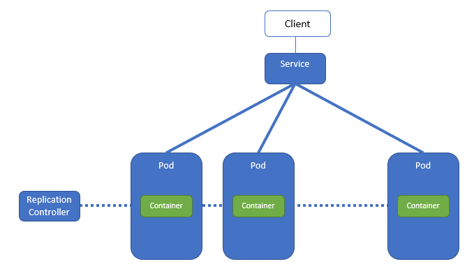

# 4. Expose your ... Pod

Already in Lab 1 we used a Service to expose the Pod to the outside world. We need a Service because directly exposing Pods to clients is not a good idea:



In the above figure, we see a ReplicationController that controls a set of Pods. The benefits are clear: the ReplicationController starts/stops Pods as many as needed. And when a Pod crashes, the ReplicationController starts a new Pod somewhere in the Kubernetes Cluster. For clients, this leads to the following problems:

- traffic must be routed - load balanced - over multiple destinations (Pods)
- these destinations IP address are not known beforehand: Pods get their IP address upon creation
- at any moment, a Pod may disappear or be created

The Service will hide all this Pod and ReplicationController behavior and provide one single access point to clients.

Time for hands-on.

## 4.1 A simple Service

In this lab, we'll make a simple service that accesses some containers - just like we did in lab 1. However, there we used `kubectl` commands to achieve the configuration. Here, we will use manifest files (all in the `lab 4` directory) for the ReplicationController and the Service.

The ReplicationController is the one from lab 3, so it doesn't need much introduction:

```bash
apiVersion: v1
kind: ReplicationController       # type of resource
metadata:
  name: terra10-rc                # name
spec:
  replicas: 3                     # desired number of Pods
  selector:
    app: terra10                  # Label Selector for counting Pods
  template:                       # Pod specification starts here
    metadata:
      labels:                     # Pod labels
        app: terra10              # the label that is also used in the Label Selector
    spec:                         # start of Container specification
      containers:
      - name: terra10
        image: lgorissen/terra10
        ports:
        - containerPort: 8080
```

The manifest file for the Service:

```bash
apiVersion: v1
kind: Service         # type of resource
metadata:
  name: terra10       # name of Service
spec:
  ports:
  - port: 80          # external port, i.e. port for client access
    targetPort: 8080  # Pod (container) port that the Service forwards to
  selector:
    app: terra10      # Label select: selects all Pods with label 'app=terra10'
```

First, fire up the Replication Controller:

```bash
developer@developer-VirtualBox:~/projects/k4d-short/lab 04$ kubectl create -f terra10-rc.yaml 
replicationcontroller/terra10-rc created
developer@developer-VirtualBox:~/projects/k4d-short/lab 04$ kubectl get rc
NAME         DESIRED   CURRENT   READY     AGE
terra10-rc   3         3         3         7s
developer@developer-VirtualBox:~/projects/k4d-short/lab 04$
```

Next, create the Service:

```bash
developer@developer-VirtualBox:~/projects/k4d-short/lab 04$ kubectl create -f terra10-service.yaml 
service/terra10 created
developer@developer-VirtualBox:~/projects/k4d-short/lab 04$ kubectl get service
NAME         TYPE        CLUSTER-IP      EXTERNAL-IP   PORT(S)   AGE
kubernetes   ClusterIP   10.96.0.1       <none>        443/TCP   10d
terra10      ClusterIP   10.102.181.8    <none>        80/TCP    5s
developer@developer-VirtualBox:~/projects/k4d-short/lab 04$
```

Beware: the Service's **Cluster IP** is shown: the Service is accessible **from within the Kubernetes Cluster** on that IP address: 10.102.181.8!

If you are on a Cluster node (or the Node that you are running Minikube on), you can verify the correct operation of the Service using `curl`:

```bash
developer@developer-VirtualBox:~$ while true; do curl 10.102.181.8; sleep 5; done
Hello, you landed on Terra10 and host terra10-rc-67fmf welcomes you!
Hello, you landed on Terra10 and host terra10-rc-zkwt5 welcomes you!
Hello, you landed on Terra10 and host terra10-rc-zkwt5 welcomes you!
Hello, you landed on Terra10 and host terra10-rc-67fmf welcomes you!
Hello, you landed on Terra10 and host terra10-rc-zkwt5 welcomes you!
Hello, you landed on Terra10 and host terra10-rc-67fmf welcomes you!
Hello, you landed on Terra10 and host terra10-rc-5tmq6 welcomes you!
^C
developer@developer-VirtualBox:~$ 
```

Another option is to run the `curl` command from one of the Pods, using `kubectl exec`:

```bash
developer@developer-VirtualBox:~$ kubectl get pod
NAME               READY     STATUS    RESTARTS   AGE
terra10-rc-5tmq6   1/1       Running   2          13h
terra10-rc-67fmf   1/1       Running   2          13h
terra10-rc-zkwt5   1/1       Running   2          13h
developer@developer-VirtualBox:~$ kubectl exec terra10-rc-5tmq6 -- curl -s 10.102.181.8
Hello, you landed on Terra10 and host terra10-rc-zkwt5 welcomes you!
```
Note that the request is answered by a different Pod than the one that is sending the request: the Service selects a random Pod to send the request to.


**Clean up**